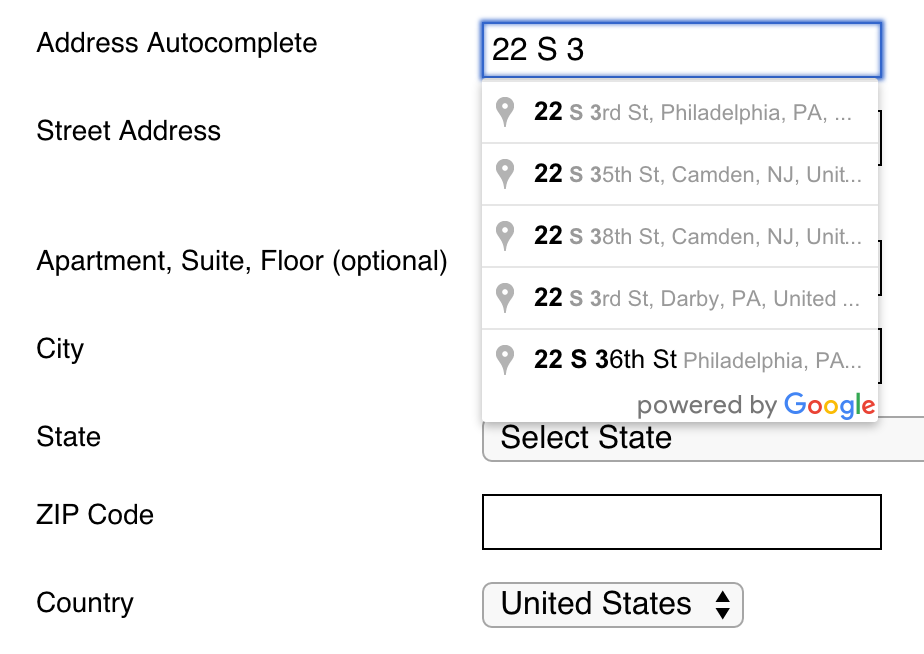

Workarea Google Address Autocomplete
================================================================================

A Workarea Commerce plugin that adds a [Google Maps address autocomplete](https://developers.google.com/maps/documentation/javascript/examples/places-autocomplete-addressform) field to the addresses step of checkout in the Workarea Storefront. This
field searches Google Maps for an address and autocompletes the standard address
fields with the selected address.



Getting Started
--------------------------------------------------------------------------------

Add the gem to your application's Gemfile:

```ruby
# ...
gem 'workarea-google_address_autocomplete'
# ...
```

Update your application's bundle.

```bash
cd path/to/application
bundle
```

Configuration
--------------------------------------------------------------------------------

To integrate your Workarea application with Google Address Autocomplete you need configure your host application with your Google Address Autocomplete `apiKey`,
which must be obtained [here](https://developers.google.com/maps/documentation/javascript/get-api-key)

You should use application secrets to do this. Add the following config to your `secrets.yml` file

```yaml
# ...
google_address_autocomplete:
  :api_key: 'YOUR_API_KEY'
# ...
```

This plugin adds a `config.js` file to the Storefront's JavaScript manifest.

The object that this file provides contains two properties:

- `apiKey`
which must be added to `secrets.yml` (see above)
which must be obtained [here](https://developers.google.com/maps/documentation/javascript/get-api-key)
and,
- `mappings` which contains an object that maps Google Places [component types](https://github.com/ubilabs/geocomplete#address-and-places-specific-component-types)
and selector strings that match input elements within the autocomplete-enabled
form. For example:

```javascript
mappings: {
    'street_number': {  // Google Places Component Type
        selector: '[name$="address[street]"]',  // Selector for a form field
        shortName: false  // Abbreviated?
    },
    'route': {
        selector: '[name$="address[street]"]',
        shortName: false
    },
    'locality': {
        selector: '[name$="address[city]"]',
        shortName: false
    },

    ... etc ...

}
```

If none of the input `[name]`s for the address partial have been changed in your
project, this plugin should work out of the box. If you have modified any of these
attributes, or if you are wishing to collect more data from this plugin, you'll
need to modify or expand this configuration object for your project.

Workarea Commerce Documentation
--------------------------------------------------------------------------------

See [https://developer.workarea.com](https://developer.workarea.com) for Workarea Commerce documentation.

License
--------------------------------------------------------------------------------

Workarea Google Address Autocomplete is released under the [Business Software License](LICENSE)
